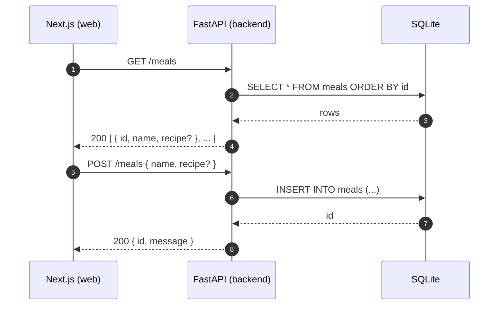

# MealApp – Architecture

## Overview
MealApp is a small two-tier system:
- **Frontend**: Next.js 16 (App Router, TypeScript, Tailwind) served in dev at `http://localhost:3000`.
- **Backend**: FastAPI (Python 3.13) exposing REST endpoints, running in dev at `http://127.0.0.1:8001`.
- **Database**: SQLite (`backend/app.db`) persisted via SQLAlchemy 2.x ORM.

The frontend calls the backend over HTTP using a tiny client in `web/src/lib/api.ts`.

## High-level flow

